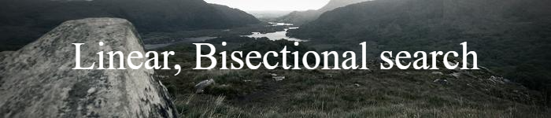

## What project do?
___
Project shows linear and biseation search on example, supported by read and wrtie to file and array of structures. 

## How to use?
___
Just import project to CodeBlocks and compile/run. When program starts it shows up contence of "students.csv" file. Then you can choose which algorithm use to search and value searched. Afterall the search results will be saved in "results.csv" in project directory.

<!--https://banner.godori.dev/-->
<!--https://shields.io/-->
<!--https://carbon.now.sh/-->